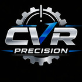

<html lang="fr">
<head>
<meta charset="UTF-8">
<meta name="viewport" content="width=device-width, initial-scale=1.0">

<title>CVR PRECISION | Rachat de matériel industriel d'occasion</title>

<meta name="description" content="CVR PRECISION rachète vos machines industrielles, machines-outils, équipements professionnels et matériels industriels d'occasion partout en France. Estimation rapide sur photos.">
<meta name="keywords" content="rachat machine outil, machines industrielles occasion, centre usinage occasion, matériel industriel occasion, rachat équipement industriel">
<meta name="author" content="CVR PRECISION">

<meta name="robots" content="index, follow">
<meta name="theme-color" content="#08111f">

<link rel="canonical" href="https://cvrprecision.fr/">

<meta property="og:title" content="CVR PRECISION - Rachat de matériel industriel d'occasion">
<meta property="og:description" content="Nous rachetons votre matériel industriel d'occasion rapidement et simplement.">
<meta property="og:type" content="website">
<meta property="og:image" content="logo.png">

<meta name="twitter:card" content="summary_large_image">
<meta name="twitter:title" content="CVR PRECISION">
<meta name="twitter:description" content="Rachat de matériel industriel d'occasion.">

<link rel="preconnect" href="https://fonts.googleapis.com">
<link rel="preconnect" href="https://fonts.gstatic.com" crossorigin>

<link href="https://fonts.googleapis.com/css2?family=Inter:wght@300;400;500;600;700;800;900&display=swap" rel="stylesheet">

<link rel="stylesheet" href="https://cdnjs.cloudflare.com/ajax/libs/font-awesome/6.5.2/css/all.min.css">

</head>

<body>

<header>

<nav class="nav-links">
<a href="#accueil">Accueil</a>
<a href="#presentation">Présentation</a>
<a href="#rachat">Nous rachetons</a>
<a href="#services">Prestations</a>
<a href="#contact">Contact</a>
</nav>

<i class="fa-solid fa-bars"></i>

</header>

<main>

<section class="hero" id="accueil">

<h1>
Nous rachetons votre
matériel industriel
d'occasion
</h1>

Une solution rapide, simple et sécurisée pour valoriser vos équipements industriels.

<a href="#contact" class="btn btn-primary">
<i class="fa-solid fa-file-invoice"></i>
Demander une estimation
</a>

<a href="#contact" class="btn btn-outline">
<i class="fa-solid fa-phone"></i>
Nous contacter
</a>

</section>
<!-- PARTIE 2/10 -->

<section id="presentation">

<h2>Présentation de CVR PRECISION</h2>

Une expertise dédiée au matériel industriel professionnel.

Dans le cadre de notre activité, nous recherchons régulièrement du matériel professionnel et industriel d'occasion, à l'unité ou en lot.

Vous disposez d'équipements inutilisés, remplacés, en surplus, en arrêt de production ou destinés à la réforme ?

CVR PRECISION peut vous proposer une estimation rapide à partir de simples photos et informations.

Nous intervenons auprès des entreprises industrielles, ateliers de production, professionnels de la mécanique, fabricants et exploitants partout en France.

<a href="#contact" class="btn btn-primary">
<i class="fa-solid fa-camera"></i>
Envoyer vos équipements
</a>

<i class="fa-solid fa-industry"></i>

<h3>Expert industriel</h3>

Rachat, valorisation et enlèvement de matériels professionnels directement auprès des entreprises.

<i class="fa-solid fa-truck-fast"></i>

<h3>Intervention nationale</h3>

Organisation complète du démontage, chargement et transport.

</section>

<section id="rachat">

<h2>Nous rachetons</h2>

Une large gamme de matériels industriels.

<i class="fa-solid fa-gears"></i>
<h3>Machines-outils</h3>

Centres d'usinage, tours CNC, fraiseuses et équipements industriels.

<i class="fa-solid fa-bolt"></i>
<h3>Groupes électrogènes</h3>

Groupes de secours, générateurs industriels et équipements énergétiques.

<i class="fa-solid fa-tree"></i>
<h3>Machines à bois</h3>

Machines professionnelles pour l'industrie du bois.

<i class="fa-solid fa-industry"></i>
<h3>Machines aluminium</h3>

Équipements de fabrication aluminium et production industrielle.

<i class="fa-solid fa-dolly"></i>
<h3>Manutention</h3>

Chariots élévateurs, matériels de levage et équipements logistiques.

<i class="fa-solid fa-truck-monster"></i>
<h3>Engins de chantier</h3>

Matériels TP, véhicules industriels et équipements lourds.

<i class="fa-solid fa-car"></i>
<h3>Véhicules professionnels</h3>

Utilitaires, poids lourds et véhicules d'entreprise.

<i class="fa-solid fa-scissors"></i>
<h3>Outils coupants</h3>

Carbure, porte-outils et stocks industriels.

<i class="fa-solid fa-industry"></i>
<h3>Lignes de production</h3>

Machines complètes et équipements de production.

<i class="fa-solid fa-boxes-stacked"></i>
<h3>Stocks industriels</h3>

Surplus, composants et matériels inutilisés.

<i class="fa-solid fa-layer-group"></i>
<h3>Tous matériels industriels</h3>

Nous étudions toutes propositions.

</section>

<!-- PARTIE 3/10 -->

<section id="services">

<h2>Nos prestations</h2>

Une prise en charge complète de vos équipements industriels.

<i class="fa-solid fa-camera"></i>

<h3>Estimation sur photos</h3>

Envoyez-nous simplement des photos et les informations disponibles. Notre équipe réalise une première analyse rapidement.

<i class="fa-solid fa-chart-line"></i>

<h3>Valorisation rapide</h3>

Nous trouvons la meilleure solution pour donner une seconde vie à vos équipements professionnels.

<i class="fa-solid fa-screwdriver-wrench"></i>

<h3>Achat en l'état</h3>

Nous achetons les machines dans leur état actuel, même avec des défauts ou nécessitant une remise en service.

<i class="fa-solid fa-ban"></i>

<h3>Aucune garantie demandée</h3>

Une solution simple adaptée aux entreprises souhaitant libérer rapidement leur espace industriel.

<i class="fa-solid fa-map-location-dot"></i>

<h3>Déplacement national</h3>

Nous intervenons partout en France pour récupérer vos équipements.

<i class="fa-solid fa-warehouse"></i>

<h3>Sortie d'usine</h3>

Organisation complète de la récupération depuis votre site industriel.

<i class="fa-solid fa-truck"></i>

<h3>Chargement et transport</h3>

Nos solutions comprennent la manutention et l'organisation du transport adapté.

<i class="fa-solid fa-file-invoice"></i>

<h3>Transport CMR</h3>

Gestion professionnelle des opérations de transport avec documents adaptés.

<i class="fa-solid fa-money-bill-transfer"></i>

<h3>Paiement intégral</h3>

Le règlement est effectué avant l'enlèvement du matériel selon les modalités convenues.

</section>

<section id="avantages">

<h2>Pourquoi choisir CVR PRECISION</h2>

Un partenaire fiable pour vos équipements industriels.

01

<i class="fa-solid fa-bolt"></i>

<h3>Réactivité</h3>

Une réponse rapide pour étudier vos propositions et avancer efficacement.

02

<i class="fa-solid fa-user-tie"></i>

<h3>Professionnalisme</h3>

Une approche adaptée aux contraintes des entreprises industrielles.

03

<i class="fa-solid fa-shield-halved"></i>

<h3>Paiement sécurisé</h3>

Des transactions claires et sécurisées avant enlèvement.

04

<i class="fa-solid fa-clock"></i>

<h3>Rapidité</h3>

Une organisation efficace pour réduire les délais.

05

<i class="fa-solid fa-handshake"></i>

<h3>Accompagnement</h3>

Un interlocuteur unique pour suivre votre projet.

06

<i class="fa-solid fa-earth-europe"></i>

<h3>Intervention nationale</h3>

Une présence auprès des professionnels partout en France.

</section>

<section id="chiffres">

<i class="fa-solid fa-industry"></i>

<strong class="counter" data-target="500">0</strong>

Matériels étudiés

<i class="fa-solid fa-location-dot"></i>

<strong class="counter" data-target="100">0</strong>

Déplacements réalisés

<i class="fa-solid fa-users"></i>

<strong class="counter" data-target="15">0</strong>

Années d'expérience

<i class="fa-solid fa-truck-fast"></i>

<strong class="counter" data-target="48">0</strong>

Heures pour une première réponse

</section>

<!-- PARTIE 4/10 -->

<section id="methode">

<h2>Notre méthode</h2>

Un processus simple, rapide et transparent.

<i class="fa-solid fa-camera"></i>

<h3>1. Envoi des informations</h3>

Vous nous transmettez les photos, références machines, années, caractéristiques techniques et informations disponibles.

<i class="fa-solid fa-magnifying-glass-chart"></i>

<h3>2. Étude et estimation</h3>

Notre équipe analyse votre matériel afin de déterminer une proposition adaptée au marché.

<i class="fa-solid fa-file-signature"></i>

<h3>3. Validation de l'offre</h3>

Après accord, nous organisons ensemble les modalités d'enlèvement.

<i class="fa-solid fa-truck-ramp-box"></i>

<h3>4. Enlèvement du matériel</h3>

Nous organisons la sortie, la manutention et le transport de vos équipements.

<i class="fa-solid fa-euro-sign"></i>

<h3>5. Paiement</h3>

Le règlement est effectué selon les conditions définies avant l'enlèvement.

</section>

<section id="galerie">

<h2>Nos équipements industriels</h2>

Quelques exemples d'univers industriels.

</section>

<button class="close-lightbox">
<i class="fa-solid fa-xmark"></i>
</button>

<!-- PARTIE 5/10 -->

<section id="contact">

<h2>Contactez CVR PRECISION</h2>

Une question, une machine à vendre ou un projet industriel ?

<i class="fa-solid fa-building"></i>

<h3>Entreprise</h3>

CVR PRECISION

<i class="fa-solid fa-user"></i>

<h3>Votre interlocuteur</h3>

Eric

<i class="fa-solid fa-phone"></i>

<h3>Téléphone</h3>

<a href="tel:+33695527388">
+33 6 95 52 73 88
</a>

<a class="small-btn" href="tel:+33695527388">
Appeler
</a>

<i class="fa-solid fa-envelope"></i>

<h3>Email</h3>

<a href="mailto:cvr.precision@gmail.com">
cvr.precision@gmail.com
</a>

<a class="small-btn" href="mailto:cvr.precision@gmail.com">
Envoyer un email
</a>

<i class="fa-solid fa-location-dot"></i>

<h3>Adresse</h3>

131 Boulevard Carnot 
78110 Le Vésinet

<form>

<label for="nom">
Nom
</label>

<input 
id="nom"
type="text"
placeholder="Votre nom"
required>

<label for="entreprise">
Entreprise
</label>

<input 
id="entreprise"
type="text"
placeholder="Votre entreprise">

<label for="telephone">
Téléphone
</label>

<input 
id="telephone"
type="tel"
placeholder="Votre téléphone">

<label for="email">
Email
</label>

<input 
id="email"
type="email"
placeholder="Votre email"
required>

<label for="message">
Message
</label>

<textarea
id="message"
rows="5"
placeholder="Décrivez votre matériel"></textarea>

<button type="submit" class="btn btn-primary">

<i class="fa-solid fa-paper-plane"></i>

Envoyer la demande

</button>

</form>

<iframe
src="https://maps.google.com/maps?q=131%20Boulevard%20Carnot%2078110%20Le%20V%C3%A9sinet&t=&z=15&ie=UTF8&iwloc=&output=embed"
loading="lazy"
allowfullscreen=""
title="Localisation CVR PRECISION">
</iframe>

</section>

<footer>

Rachat et valorisation de matériels industriels d'occasion partout en France.

<a href="#">
<i class="fa-brands fa-linkedin-in"></i>
</a>

<a href="#">
<i class="fa-brands fa-facebook-f"></i>
</a>

<a href="#">
<i class="fa-brands fa-instagram"></i>
</a>

<h3>Navigation</h3>

<a href="#accueil">Accueil</a>

<a href="#presentation">Présentation</a>

<a href="#rachat">Matériels</a>

<a href="#services">Prestations</a>

<a href="#contact">Contact</a>

<h3>Coordonnées</h3>

<i class="fa-solid fa-phone"></i>
+33 6 95 52 73 88

<i class="fa-solid fa-envelope"></i>
cvr.precision@gmail.com

<i class="fa-solid fa-location-dot"></i>
Le Vésinet, France

© 2026 CVR PRECISION - Tous droits réservés.

</footer>

<button class="top-btn">

<i class="fa-solid fa-arrow-up"></i>

</button>

<!-- PARTIE 6/10 -->

<!-- PARTIE 7/10 -->

<!-- PARTIE 8/10 -->

<section id="engagement">

<h2>Notre engagement</h2>

Une approche professionnelle basée sur la confiance et la transparence.

<i class="fa-solid fa-recycle"></i>

<h3>Donner une seconde vie</h3>

Nous contribuons à la revalorisation des équipements industriels en favorisant leur réutilisation.

<i class="fa-solid fa-handshake-angle"></i>

<h3>Une relation durable</h3>

Nous privilégions des échanges simples, rapides et professionnels avec nos partenaires.

<i class="fa-solid fa-industry"></i>

<h3>Culture industrielle</h3>

Notre connaissance du secteur permet d'évaluer différents types d'équipements professionnels.

</section>

<!-- PARTIE 9/10 -->

<section id="cta">

<h2>
Vous avez du matériel industriel à valoriser ?
</h2>

Contactez CVR PRECISION dès aujourd'hui pour obtenir une première estimation.

<a href="tel:+33695527388" class="btn btn-primary">

<i class="fa-solid fa-phone"></i>

Appeler maintenant

</a>

<a href="mailto:cvr.precision@gmail.com" class="btn btn-outline">

<i class="fa-solid fa-envelope"></i>

Envoyer un email

</a>

</section>

<section id="mentions">

<h2>
Informations légales
</h2>

CVR PRECISION - Rachat et valorisation de matériels industriels d'occasion.

Les informations présentes sur ce site sont fournies à titre indicatif et peuvent évoluer.

Toute reproduction totale ou partielle du contenu du site sans autorisation préalable est interdite.

</section>

<!-- PARTIE 10/10 -->

<!-- DONNEES STRUCTUREES SUPPLEMENTAIRES SEO -->

<!-- FIN DU SITE -->

</main>

</body>

</html>
